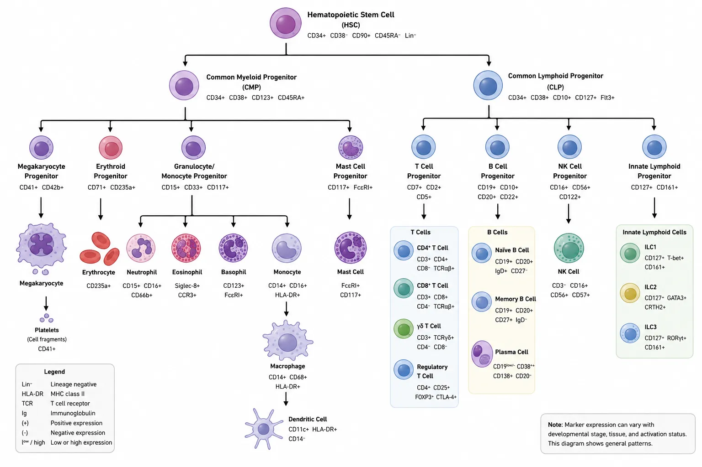

# Immune Cell Populations and Common Markers

Immune cells are usually identified by **marker combinations**, not by one marker alone. A “marker” is a molecule that can be detected on the cell surface, inside the cell, or at the RNA level. Many common markers are named with **CD numbers**, where CD means **cluster of differentiation**. CD markers are standardized names for cell-surface molecules used to identify leukocytes and other immune-related cells, but most markers are not perfectly unique to one cell type. For example, CD4 is strongly associated with helper T cells, but CD4 can also appear on some other immune cells, so researchers usually define a helper T cell as **CD45⁺ CD3⁺ CD4⁺**, not simply “CD4⁺.” CD nomenclature is maintained through the Human Leukocyte Differentiation Antigen workshops and is widely used in flow cytometry, CyTOF, imaging, and cell sorting. ([PubMed][1])

In marker notation, **“+”** means the marker is present, **“−”** means absent or very low, **“hi”** means high expression, **“lo”** means low expression, and **“dim”** means weak but detectable expression. A phrase like **CD4⁺CD25hiCD127loFOXP3⁺** describes a cell population using several markers at once.

## 1. The big picture: immune-cell lineages

Most immune cells are **leukocytes**, or white blood cells. A broad marker for leukocytes is **CD45**, also called leukocyte common antigen. The immune system is often divided into two big functional branches:

**Innate immune cells** respond quickly and recognize broad danger patterns. These include neutrophils, monocytes, macrophages, dendritic cells, natural killer cells, eosinophils, basophils, mast cells, and innate lymphoid cells.

**Adaptive immune cells** respond more specifically and can form memory. These include T cells and B cells. T cells and B cells use highly specific antigen receptors: the **T-cell receptor** on T cells and the **B-cell receptor/immunoglobulin** on B cells.

Developmentally, immune cells come from hematopoietic stem and progenitor cells in the bone marrow. Classic immunology texts describe lymphocytes, monocytes/macrophages, dendritic cells, granulocytes, and mast cells as major immune-cell groups derived from hematopoietic precursors. ([NCBI][2]) The Human Protein Atlas immune-cell datasets also group human immune cells into major lineages such as T cells, B cells, NK cells, monocytes, granulocytes, dendritic cells, and progenitors. ([Human Protein Atlas][3])

## 2. Quick reference: major immune-cell populations

| Cell population               | Common human markers                           | Common mouse markers                              | Main idea                                               |
| ----------------------------- | ---------------------------------------------- | ------------------------------------------------- | ------------------------------------------------------- |
| **All leukocytes**            | CD45                                           | CD45                                              | Broad white-blood-cell gate                             |
| **T cells**                   | CD3, TCRαβ or TCRγδ                            | CD3, TCRβ, TCRγδ                                  | Adaptive lymphocytes that recognize antigen through TCR |
| **CD4 T cells**               | CD3⁺ CD4⁺                                      | CD3⁺ CD4⁺                                         | Helper/regulatory T-cell compartment                    |
| **CD8 T cells**               | CD3⁺ CD8α⁺                                     | CD3⁺ CD8α⁺                                        | Cytotoxic T-cell compartment                            |
| **B cells**                   | CD19, CD20, CD79a/b, surface Ig                | B220/CD45R, CD19, CD79a/b, surface Ig             | Antibody-lineage cells                                  |
| **Plasmablasts/plasma cells** | CD27hi CD38hi, CD138, CD20lo/−                 | CD138, B220lo/−, CD19 variable                    | Antibody-secreting cells                                |
| **NK cells**                  | CD45⁺ CD3⁻ CD56⁺ and/or CD16⁺                  | CD3⁻ NKp46⁺, NK1.1 strain-dependent, CD49b/DX5    | Innate cytotoxic lymphocytes                            |
| **Monocytes**                 | CD14, CD16, CD11b, CD33, HLA-DR                | CD11b, CD115, Ly6C, CCR2, CX3CR1                  | Circulating myeloid cells that can enter tissues        |
| **Macrophages**               | CD68, CD64, CD14, CD163, CD206, MerTK          | F4/80, CD64, CD11b, MerTK, CD206                  | Tissue phagocytes and tissue-maintenance cells          |
| **Dendritic cells**           | HLA-DR, CD11c, CD1c, CD141, CD123, CD303       | MHC-II, CD11c, CD8α, CD103, CD11b, B220, Siglec-H | Antigen-presenting cells                                |
| **Neutrophils**               | CD15, CD16, CD66b, CD11b, CD10                 | CD11b, Ly6G, Ly6Cint                              | Fast inflammatory granulocytes                          |
| **Eosinophils**               | Siglec-8, CCR3, CD125, CD11b                   | Siglec-F, CCR3, CD11b, CD125                      | Type 2 immunity, allergy, parasites                     |
| **Basophils**                 | FcεRI, CD123, CCR3, CD203c, CD63 on activation | FcεRI, CD49b, CD200R3, c-Kit⁻                     | Circulating type 2/allergy granulocytes                 |
| **Mast cells**                | CD117/c-Kit, FcεRI, tryptase, CD203c           | CD117/c-Kit, FcεRI                                | Tissue-resident allergy and barrier-defense cells       |
| **ILCs**                      | Lin⁻ CD45⁺ CD127⁺, subset markers below        | Lin⁻ CD45⁺ CD127⁺, subset markers below           | Innate lymphoid cells resembling helper T-cell programs |
| **HSPCs**                     | CD34, CD38, CD90, CD45RA, CD49f                | Lin⁻ Sca-1⁺ c-Kit⁺, CD150, CD48                   | Stem/progenitor cells that generate blood lineages      |

This table is a starting point. In practice, panels must be adjusted for **species, tissue, disease state, activation state, sample processing, and platform**. Marker combinations are especially important because many immune markers are shared across lineages or change after activation. ([AAT Bioquest][4])

## 3. T cells

T cells are adaptive immune cells defined by the **T-cell receptor complex**. In flow cytometry, mature T cells are commonly identified as **CD45⁺ CD3⁺** cells. CD3 is part of the TCR signaling complex and is one of the most useful pan-T-cell markers.

The two best-known T-cell branches are **CD4 T cells** and **CD8 T cells**. CD4 T cells generally recognize antigen presented on **MHC class II**, while CD8 T cells generally recognize antigen presented on **MHC class I**. CD4 and CD8 are not just labels; they are co-receptors that help the TCR engage peptide-MHC complexes. ([NCBI][5])

## Core T-cell markers

| T-cell population           | Common markers              | Notes                                             |
| --------------------------- | --------------------------- | ------------------------------------------------- |
| **Total T cells**           | CD45⁺ CD3⁺ TCRαβ⁺ or TCRγδ⁺ | CD3 is the usual pan-T-cell marker                |
| **CD4 T cells**             | CD3⁺ CD4⁺ CD8⁻              | Helper and regulatory T-cell compartment          |
| **CD8 T cells**             | CD3⁺ CD8⁺ CD4⁻              | Cytotoxic T-cell compartment                      |
| **Double-negative T cells** | CD3⁺ CD4⁻ CD8⁻              | Includes γδ T cells, some unconventional T cells  |
| **Double-positive T cells** | CD3⁺ CD4⁺ CD8⁺              | Common in thymus; rare in normal peripheral blood |
| **αβ T cells**              | CD3⁺ TCRαβ⁺                 | Main conventional T-cell population               |
| **γδ T cells**              | CD3⁺ TCRγδ⁺                 | Unconventional T cells enriched at barrier sites  |

### CD4 T-helper subsets

CD4 T cells help coordinate immune responses. Researchers often define CD4 subsets by a combination of **surface chemokine receptors**, **transcription factors**, and **cytokines**. Surface markers are useful when sorting live cells; transcription factors and cytokines often require fixation, permeabilization, or stimulation.

| CD4 subset                    | Common markers                                                | Main function                                                       |
| ----------------------------- | ------------------------------------------------------------- | ------------------------------------------------------------------- |
| **Th1**                       | CD4⁺ CXCR3⁺, CCR5⁺, T-bet/TBX21⁺, IFN-γ⁺                      | Supports macrophage activation and intracellular pathogen responses |
| **Th2**                       | CD4⁺ CCR4⁺, CRTH2/CD294⁺, GATA3⁺, IL-4⁺ IL-5⁺ IL-13⁺          | Type 2 immunity, allergy, parasite responses                        |
| **Th17**                      | CD4⁺ CCR6⁺, often CD161⁺, RORγt/RORC⁺, IL-17A⁺ IL-17F⁺ IL-22⁺ | Barrier immunity, fungal and extracellular bacterial responses      |
| **Tfh**                       | CD4⁺ CXCR5⁺ PD-1⁺ ICOS⁺ BCL6⁺, IL-21⁺                         | Helps B cells in follicles and germinal centers                     |
| **Treg**                      | CD4⁺ CD25hi CD127lo FOXP3⁺, often CTLA-4⁺                     | Suppresses excessive immune responses and supports tolerance        |
| **Tr1-like regulatory cells** | CD4⁺ FOXP3⁻ IL-10⁺, often LAG-3⁺ CD49b⁺                       | Regulatory cytokine-producing cells, context-dependent              |
| **Th22-like cells**           | CD4⁺ CCR6⁺ CCR4⁺ CCR10⁺, IL-22⁺                               | Skin/barrier-associated inflammation and repair                     |

Chemokine receptor patterns such as CXCR3, CCR4, CCR6, and CXCR5 are commonly used to enrich human helper T-cell subsets, while transcription factors such as T-bet, GATA3, RORγt, BCL6, and FOXP3 reflect lineage programs. ([ACS Publications][6]) For Tregs, **CD25hi FOXP3⁺** is classic, and **low CD127** is widely used to identify or sort live human regulatory T cells because FOXP3 staining is intracellular. ([PubMed][7])

### CD8 T cells and cytotoxic T cells

CD8 T cells are often called cytotoxic T cells because many of them can kill infected, stressed, or malignant cells. They commonly express cytotoxic molecules such as **granzyme B**, **perforin**, **granulysin**, and **NKG7**. Degranulation can be measured using **CD107a/LAMP-1** after stimulation.

| CD8/cytotoxic state                 | Common markers                                 | Notes                                                              |
| ----------------------------------- | ---------------------------------------------- | ------------------------------------------------------------------ |
| **Naive CD8 T cells**               | CD3⁺ CD8⁺ CD45RA⁺ CCR7⁺ CD27⁺ CD28⁺            | Antigen-inexperienced or stem-like resting phenotype               |
| **Effector CD8 T cells**            | CD8⁺ granzyme B⁺ perforin⁺, often CX3CR1⁺      | Immediate cytotoxic function                                       |
| **Memory CD8 T cells**              | CD45RO⁺ or antigen-experienced marker patterns | Long-lived antigen-experienced cells                               |
| **Terminal effector/TEMRA**         | CD45RA⁺ CCR7⁻, often CD27⁻ CD28⁻ CD57⁺         | Highly differentiated cytotoxic phenotype                          |
| **Exhausted/dysfunctional T cells** | PD-1⁺, TIM-3⁺, LAG-3⁺, TIGIT⁺, TOX⁺            | Seen in chronic infection, cancer, and persistent antigen exposure |

A useful caution: **PD-1 alone does not prove exhaustion**. PD-1 can also mark recently activated T cells. Stronger evidence for exhaustion usually comes from a pattern of multiple inhibitory receptors, altered transcription factors such as TOX, reduced function, and the biological context. Reviews of T-cell activation and exhaustion emphasize that markers such as CD69, CD25, HLA-DR, CD137, PD-1, TIM-3, LAG-3, TIGIT, and TOX should be interpreted as part of a broader phenotype. ([Wiley Online Library][8])

### T-cell memory markers

T-cell memory subsets are commonly separated using **CD45RA, CD45RO, CCR7, CD62L, CD27, CD28, and CD95**. The exact definition varies by lab and species.

| Memory subset                     | Common human markers                   | Plain-English meaning                                        |
| --------------------------------- | -------------------------------------- | ------------------------------------------------------------ |
| **Naive T cell**                  | CD45RA⁺ CCR7⁺ CD62L⁺ CD27⁺ CD28⁺ CD95⁻ | Has not yet become a typical antigen-experienced memory cell |
| **Stem-cell memory T cell, Tscm** | CD45RA⁺ CCR7⁺ CD62L⁺ CD27⁺ CD28⁺ CD95⁺ | Memory-like cell with a naive-like surface phenotype         |
| **Central memory, Tcm**           | CD45RO⁺ CCR7⁺ CD62L⁺ CD27⁺ CD28⁺       | Recirculates through lymphoid tissues                        |
| **Effector memory, Tem**          | CD45RO⁺ CCR7⁻ CD62L⁻                   | More tissue-homing and rapid-effector phenotype              |
| **TEMRA**                         | CD45RA⁺ CCR7⁻, often CD27⁻ CD28⁻       | Terminally differentiated effector-memory-like cell          |

Human memory T-cell subset definitions based on CD45RA/CD45RO, CCR7, CD62L, CD27, CD28, and CD95 are widely used, although freezing, tissue source, age, infection history, and stimulation can affect these markers. ([Wiley Online Library][9])

### Unconventional T cells

Some T cells do not fit neatly into the classic CD4-helper/CD8-cytotoxic model.

| Population                    | Common markers                                             | Notes                                                               |
| ----------------------------- | ---------------------------------------------------------- | ------------------------------------------------------------------- |
| **γδ T cells**                | CD3⁺ TCRγδ⁺; human Vδ1 or Vδ2 subsets                      | Often enriched at epithelial and mucosal sites                      |
| **MAIT cells**                | CD3⁺ TCR Vα7.2⁺ CD161hi; MR1 tetramer⁺                     | Recognize microbial riboflavin-pathway metabolites presented by MR1 |
| **Invariant NKT cells, iNKT** | CD3⁺ CD1d tetramer⁺; human Vα24-Jα18/Vβ11; mouse Vα14-Jα18 | Recognize lipid antigens presented by CD1d                          |
| **NKT-like cells**            | CD3⁺ plus NK-associated markers such as CD56 or CD16       | Not the same as invariant CD1d-restricted NKT cells                 |

MAIT cells are often identified in humans as **Vα7.2⁺ CD161hi** T cells, but MR1 tetramers provide a more specific identification strategy. ([PubMed][10])

## 4. B cells and antibody-secreting cells

B cells are adaptive immune cells that can become antibody-producing plasmablasts and plasma cells. In human blood, B cells are usually gated as **CD45⁺ CD3⁻ CD19⁺** cells. CD20 is also common, but CD20 is reduced or absent on many plasmablasts and plasma cells, so CD19, CD38, CD27, and CD138 are often important when studying late B-cell differentiation.

| B-cell population                           | Common human markers                                                     | Plain-English meaning                                         |
| ------------------------------------------- | ------------------------------------------------------------------------ | ------------------------------------------------------------- |
| **Total B cells**                           | CD19⁺ CD20⁺/variable CD79a/b⁺ surface Ig⁺                                | General B-cell gate                                           |
| **Naive B cells**                           | CD19⁺ IgD⁺ CD27⁻                                                         | Mature B cells that have not become memory cells              |
| **Transitional B cells**                    | CD19⁺ CD24hi CD38hi, often IgD⁺ CD27⁻                                    | Recently developed B cells leaving bone marrow                |
| **Unswitched memory B cells**               | CD19⁺ IgD⁺ CD27⁺                                                         | Memory-like B cells that still express IgD                    |
| **Class-switched memory B cells**           | CD19⁺ IgD⁻ CD27⁺, IgG⁺ or IgA⁺                                           | Antigen-experienced B cells that changed antibody class       |
| **Double-negative memory/atypical B cells** | CD19⁺ IgD⁻ CD27⁻; often CD11c⁺ T-bet⁺ CD21lo in atypical subsets         | Expanded in some infections, autoimmunity, and aging contexts |
| **Germinal-center B cells**                 | CD19⁺ CD20⁺ CD38⁺ CD10⁺ BCL6⁺; mouse GL7⁺ Fas/CD95⁺                      | B cells undergoing affinity maturation                        |
| **Plasmablasts**                            | CD19⁺ CD20lo/− CD27hi CD38hi, CD138 variable                             | Recently activated antibody-secreting cells                   |
| **Plasma cells**                            | CD38hi CD138⁺ CD20⁻, CD19 variable, intracellular Ig high, BLIMP1/PRDM1⁺ | More mature antibody-secreting cells                          |

Human B-cell immunophenotyping commonly uses marker sets including **CD19, IgD, CD27, CD38, CD24, CD21, IgM, IgG, IgA, CD20, CD11c, FcRL5, CD138, and T-bet**, depending on how detailed the B-cell classification needs to be. ([Springer][11])

For mouse B cells, common markers include **B220/CD45R, CD19, IgM, IgD, CD21, CD23, CD5, CD11b, GL7, Fas/CD95, and CD138**. Follicular B cells are often **B220⁺ CD19⁺ CD21int CD23⁺**, marginal-zone B cells are often **CD21hi CD23lo**, germinal-center B cells are often **GL7⁺ Fas⁺**, and plasma cells are often **CD138⁺ B220lo/−**.

## 5. Natural killer cells

Natural killer cells, or NK cells, are innate lymphocytes that can kill stressed, infected, or tumor-like cells without using a rearranged T-cell receptor. Human NK cells are commonly identified as **CD45⁺ CD3⁻ CD56⁺ and/or CD16⁺**. They often express receptors such as **NKp46/CD335, NKG2D/CD314, CD94/NKG2A, NKG2C, KIRs, DNAM-1/CD226**, and cytotoxic molecules such as **granzyme B** and **perforin**. ([NCBI][12])

| NK population                      | Common human markers                               | Notes                                 |
| ---------------------------------- | -------------------------------------------------- | ------------------------------------- |
| **Total NK cells**                 | CD45⁺ CD3⁻ CD56⁺ and/or CD16⁺                      | Exclude T cells with CD3              |
| **CD56bright NK cells**            | CD56bright CD16lo/−                                | Often more cytokine-producing         |
| **CD56dim NK cells**               | CD56dim CD16⁺                                      | Often more cytotoxic in blood         |
| **Mature/differentiated NK cells** | CD57⁺, KIR⁺, NKG2A lower in some contexts          | Differentiation marker pattern varies |
| **Activated NK cells**             | CD69⁺, HLA-DR⁺, CD25⁺, CD107a⁺ after degranulation | Context-dependent activation markers  |

For mouse NK cells, common markers include **CD3⁻ NKp46⁺**, **NK1.1⁺** in NK1.1-expressing strains such as C57BL/6, and **CD49b/DX5⁺**. NK1.1 is not universal across mouse strains, so NKp46 is often useful as a broader NK-lineage marker. ([Wiley Online Library][13])

## 6. Innate lymphoid cells

Innate lymphoid cells, or ILCs, are lymphocyte-like innate immune cells. They do not express rearranged TCR or BCR antigen receptors. In humans, helper-like ILCs are often gated as **CD45⁺ lineage-negative CD127⁺** cells. “Lineage-negative” usually means negative for markers that identify T cells, B cells, NK cells, monocytes, dendritic cells, basophils, and progenitors. A lineage cocktail may include markers such as **CD3, CD14, CD19, CD20, CD34, CD56, CD11c, CD123, FcεRI, CD203c**, and others, depending on the lab. ([Wiley Online Library][14])

| ILC subset         | Common human markers                                           | Main program                                                       |
| ------------------ | -------------------------------------------------------------- | ------------------------------------------------------------------ |
| **ILC1**           | Lin⁻ CD127⁺ CD117⁻ CRTH2⁻, T-bet⁺, IFN-γ⁺                      | Th1-like innate program                                            |
| **ILC2**           | Lin⁻ CD127⁺ CRTH2/CD294⁺, CD161⁺, GATA3⁺, often ST2⁺, IL-17RB⁺ | Th2-like innate program; IL-5 and IL-13                            |
| **ILC3**           | Lin⁻ CD127⁺ CD117/c-Kit⁺ CRTH2⁻, RORγt/RORC⁺, NKp44⁺ or NKp44⁻ | Th17/Th22-like innate program; IL-17 and/or IL-22                  |
| **LTi-like cells** | Lin⁻ CD127⁺ CD117⁺ RORγt⁺                                      | Lymphoid tissue organization, mostly developmental/tissue contexts |

ILC immunophenotyping is especially context-sensitive because ILCs are rare in blood, more common in tissues, and can show plasticity between programs. Human ILC reviews commonly define ILC2 as **Lin⁻ CD127⁺ CRTH2⁺**, ILC3 as **Lin⁻ CD127⁺ CD117⁺ CRTH2⁻**, and ILC1 as **Lin⁻ CD127⁺ CD117⁻ CRTH2⁻**, with transcription factors and cytokines used for confirmation. ([FEBS Journal][15])

## 7. Monocytes

Monocytes are circulating myeloid cells that can migrate into tissues and contribute to macrophage or dendritic-cell-like populations, especially during inflammation. Human monocytes are usually identified within **CD45⁺ CD3⁻ CD19⁻ CD56⁻ HLA-DR⁺ CD11b⁺** myeloid cells, then separated by **CD14** and **CD16**.

| Human monocyte subset       | Markers                        | Plain-English meaning                                     |
| --------------------------- | ------------------------------ | --------------------------------------------------------- |
| **Classical monocytes**     | CD14⁺⁺ CD16⁻, CCR2hi CX3CR1lo  | Major blood monocyte population; inflammatory recruitment |
| **Intermediate monocytes**  | CD14⁺⁺ CD16⁺                   | Inflammatory/antigen-presentation-associated subset       |
| **Non-classical monocytes** | CD14lo CD16⁺⁺, CX3CR1hi CCR2lo | Patrolling vascular monocytes                             |

Mouse monocytes are often separated using **Ly6C, CCR2, CX3CR1, CD11b, and CD115/CSF1R**. Classical inflammatory monocytes are often **CD11b⁺ CD115⁺ Ly6Chi CCR2hi CX3CR1lo**, while non-classical monocytes are often **Ly6Clo CX3CR1hi CCR2lo**. Human CD14/CD16 monocyte subsets and their mouse Ly6C-based counterparts are widely used, although they are not perfect one-to-one matches. ([Wiley Online Library][16])

## 8. Macrophages

Macrophages are tissue-resident or tissue-infiltrating phagocytes. They remove dead cells, ingest microbes and debris, shape inflammation, help tissue repair, and present antigen in some contexts. Unlike blood monocytes, macrophages are heavily shaped by their tissue environment, so a “macrophage marker” in one tissue may not work the same way in another tissue.

| Macrophage context                              | Common markers                                                          | Notes                                                                                               |
| ----------------------------------------------- | ----------------------------------------------------------------------- | --------------------------------------------------------------------------------------------------- |
| **General human macrophages**                   | CD45⁺ CD68⁺ CD64⁺ CD14 variable, CD163 variable, CD206 variable, MerTK⁺ | CD68 is common in tissue staining; CD64/MerTK help distinguish macrophages from DCs in some tissues |
| **General mouse macrophages**                   | CD45⁺ F4/80⁺ CD64⁺ CD11b variable, MerTK⁺                               | F4/80 is common but not equally high in all macrophages                                             |
| **Inflammatory macrophage-like phenotype**      | CD80⁺ CD86⁺ HLA-DR/MHC-IIhi, TNF, IL-1β, NOS2/iNOS in mouse             | Often called “M1-like,” but real tissues are more complex                                           |
| **Repair/resolution macrophage-like phenotype** | CD163⁺ CD206⁺ MerTK⁺, IL-10, ARG1 in mouse                              | Often called “M2-like,” but this is an oversimplification                                           |
| **Microglia**                                   | CD45lo CD11b⁺ CX3CR1⁺, TMEM119⁺ P2RY12⁺                                 | Brain-resident macrophage-like cells                                                                |
| **Alveolar macrophages, mouse**                 | CD45⁺ CD11c⁺ Siglec-F⁺ F4/80⁺                                           | Lung airspace macrophages                                                                           |
| **Kupffer cells, mouse**                        | F4/80hi CD11blo CLEC4F⁺ TIM4⁺                                           | Liver-resident macrophages                                                                          |

The classic **M1/M2** macrophage language can be useful as shorthand, but it is often too simple for real tissue macrophages. Tissue macrophages frequently show mixed or specialized programs that do not fit neatly into M1 or M2 categories. Reviews of intestinal and tissue macrophages emphasize that local tissue cues strongly shape macrophage marker expression and function. ([Wiley Online Library][17])

## 9. Dendritic cells

Dendritic cells, or DCs, are professional antigen-presenting cells. They are especially important for initiating T-cell responses. In human blood and tissues, DCs are often identified as **lineage-negative HLA-DR⁺** cells, then divided into conventional dendritic cells and plasmacytoid dendritic cells. In mice, DCs are often **CD45⁺ MHC-II⁺ CD11c⁺**, with subset markers added.

| DC subset                          | Common human markers                                  | Common mouse markers                         | Main role                                         |
| ---------------------------------- | ----------------------------------------------------- | -------------------------------------------- | ------------------------------------------------- |
| **cDC1**                           | HLA-DR⁺ CD11c⁺ CD141/BDCA-3⁺ CLEC9A⁺ XCR1⁺ CADM1⁺     | MHC-II⁺ CD11c⁺ CD8α⁺ or CD103⁺ XCR1⁺ CLEC9A⁺ | Cross-presentation; antiviral/tumor immunity      |
| **cDC2**                           | HLA-DR⁺ CD11c⁺ CD1c/BDCA-1⁺ SIRPα/CD172a⁺ CD11b⁺      | MHC-II⁺ CD11c⁺ CD11b⁺ SIRPα/CD172a⁺          | CD4 T-cell priming; diverse helper responses      |
| **pDC**                            | HLA-DR⁺ CD123hi CD303/BDCA-2⁺ CD304/BDCA-4⁺ CD11c⁻/lo | B220⁺ Siglec-H⁺ BST2/PDCA-1⁺ CD11clo         | Type I interferon production, antiviral responses |
| **Monocyte-derived DC-like cells** | CD14-derived, CD11c⁺ HLA-DR⁺ CD1c/CD1a variable       | CD11b⁺ CD11c⁺ MHC-II⁺ Ly6C-derived           | Inflammation-induced DC-like populations          |

Human DC subset markers such as **CD141/CLEC9A/XCR1** for cDC1, **CD1c/SIRPα** for cDC2, and **CD123/CD303/CD304** for pDC are commonly used, but subset identification is improved by using marker combinations rather than a single marker. ([Wiley Online Library][18])

## 10. Neutrophils

Neutrophils are fast-responding granulocytes that are abundant in blood and rapidly recruited to sites of infection or tissue damage. They phagocytose microbes, release granule contents, produce reactive oxygen species, and can form neutrophil extracellular traps.

| Neutrophil population/state | Common human markers                                      | Common mouse markers                         |
| --------------------------- | --------------------------------------------------------- | -------------------------------------------- |
| **Mature neutrophils**      | CD45⁺ CD15⁺ CD66b⁺ CD16⁺ CD11b⁺ CD14⁻                     | CD45⁺ CD11b⁺ Ly6G⁺ Ly6Cint                   |
| **Immature neutrophils**    | CD10⁻, CD16 lower/variable                                | Ly6G⁺ CD11b⁺ maturation markers vary         |
| **Activated neutrophils**   | CD11b↑, CD62L shedding, CD66b↑, CD63↑                     | CD11b↑, CD62L changes, degranulation markers |
| **Low-density neutrophils** | Often CD15⁺ CD66b⁺ CD11b⁺ in PBMC fraction; CD10 variable | Context-dependent                            |

Human neutrophil marker panels often include **CD11b, CD15, CD16, CD66b, CD10, CD62L, CD63, and CD14 exclusion**. Mouse neutrophils are commonly defined with **CD11b and Ly6G**, with Ly6C used to help separate monocytes and other myeloid cells. ([PMC][19])

## 11. Eosinophils

Eosinophils are granulocytes involved in type 2 inflammation, allergic disease, parasite responses, tissue remodeling, and some antiviral or tumor contexts. They have distinctive granules and are often high side-scatter by flow cytometry, although activation and degranulation can change scatter.

| Eosinophil population      | Common human markers                                          | Common mouse markers                         |
| -------------------------- | ------------------------------------------------------------- | -------------------------------------------- |
| **Mature eosinophils**     | CD45⁺ Siglec-8⁺ CCR3/CD193⁺ CD125/IL-5Rα⁺ CD11b⁺, often CD16⁻ | CD45⁺ Siglec-F⁺ CCR3⁺ CD11b⁺ CD125⁺ Ly6G⁻    |
| **Eosinophil progenitors** | CD34⁺ CD125⁺ CD123⁺, lineage context-dependent                | CD34⁺ CD125⁺, progenitor panels vary         |
| **Activated eosinophils**  | CD69⁺, CD11b↑, CD62L changes, MHC-II in some contexts         | Similar activation markers; tissue-dependent |

Recent eosinophil marker reviews list **Siglec-8 and CCR3** as important human eosinophil markers and **Siglec-F** as a common mouse eosinophil marker, with CD125/IL-5Rα reflecting the IL-5 pathway central to eosinophil biology. ([Wiley Online Library][20])

## 12. Basophils

Basophils are rare circulating granulocytes involved in type 2 immunity and allergic responses. They express the high-affinity IgE receptor **FcεRI** and can release histamine and cytokines such as IL-4 and IL-13.

| Basophil population/state | Common human markers                                        | Notes                                                        |
| ------------------------- | ----------------------------------------------------------- | ------------------------------------------------------------ |
| **Resting basophils**     | CD45⁺ FcεRI⁺ CD123⁺ CCR3⁺ CD203c⁺/dim HLA-DR⁻, often CD117⁻ | CD117 negativity helps distinguish basophils from mast cells |
| **Activated basophils**   | CD63↑ CD203c↑ CD11b↑                                        | Used in basophil activation tests                            |
| **Mouse basophils**       | FcεRI⁺ CD49b⁺ CD200R3⁺ c-Kit⁻                               | Panels vary by tissue and study                              |

Human basophil identification often uses combinations such as **CD123⁺ HLA-DR⁻**, **CCR3⁺**, **FcεRI⁺**, **IgE⁺**, and **CD203c⁺**, while activation is commonly measured with **CD63** and/or increased **CD203c**. ([Wiley Online Library][21])

## 13. Mast cells

Mast cells are tissue-resident cells best known for allergy, anaphylaxis, barrier defense, and tissue remodeling. They are related to basophils in some functions but are not the same cell type. Mast cells are usually found in tissues rather than as a major circulating blood population.

| Mast-cell population/state | Common markers                                                 | Notes                                                                          |
| -------------------------- | -------------------------------------------------------------- | ------------------------------------------------------------------------------ |
| **Human mast cells**       | CD45⁺ CD117/c-Kit⁺ FcεRI⁺ CD203c⁺, tryptase⁺, chymase variable | Tissue-resident; tryptase and chymase are common intracellular granule markers |
| **Activated mast cells**   | CD63↑ CD107a↑ mediator release                                 | Activation can be measured by degranulation markers                            |
| **Mouse mast cells**       | CD117/c-Kit⁺ FcεRI⁺                                            | Tissue and maturation state matter                                             |

Human mast cells are commonly characterized by **CD117/c-Kit, FcεRI, CD203c, tryptase, chymase, and histamine**, with CD63 used as an activation/degranulation marker. ([Wiley Online Library][22])

## 14. Myeloid-derived suppressor cells

Myeloid-derived suppressor cells, or MDSCs, are immunosuppressive myeloid populations most often studied in cancer, chronic infection, sepsis, and inflammatory disease. They are tricky because they resemble monocytes or neutrophils by markers. A true MDSC definition should include **suppressive function**, not just phenotype.

| MDSC subset                 | Common human markers                            | Common mouse markers                |
| --------------------------- | ----------------------------------------------- | ----------------------------------- |
| **M-MDSC, monocytic MDSC**  | CD11b⁺ CD33⁺ CD14⁺ HLA-DRlo/− CD15⁻             | CD11b⁺ Ly6G⁻ Ly6Chi                 |
| **PMN-MDSC / G-MDSC**       | CD11b⁺ CD33dim CD15⁺ or CD66b⁺ CD14⁻ HLA-DRlo/− | CD11b⁺ Ly6G⁺ Ly6Clo                 |
| **Early-stage MDSC, eMDSC** | Lin⁻ HLA-DR⁻ CD33⁺, often CD11b⁺                | No exact universal mouse equivalent |

Consensus recommendations describe human PMN-MDSCs as **CD11b⁺ CD14⁻ CD15⁺ or CD66b⁺**, human M-MDSCs as **CD11b⁺ CD14⁺ HLA-DR−/lo CD15⁻**, and mouse MDSC subsets using **CD11b, Ly6G, and Ly6C**. The same recommendations emphasize that phenotype alone is not enough; suppressive activity is central to the concept. ([Nature][23])

## 15. Hematopoietic stem and progenitor cells

Although hematopoietic stem and progenitor cells, or HSPCs, are not mature immune effector cells, they are frequently studied in immunology because they generate immune lineages and respond to inflammation.

| Population                       | Common human markers                                      | Common mouse markers                                     |
| -------------------------------- | --------------------------------------------------------- | -------------------------------------------------------- |
| **HSPCs, broad**                 | CD34⁺, lineage-negative, CD38 variable                    | Lineage-negative, c-Kit⁺, Sca-1 variable                 |
| **Enriched human HSCs**          | Lin⁻ CD34⁺ CD38⁻ CD45RA⁻ CD90⁺; CD49f used in some panels | Lin⁻ Sca-1⁺ c-Kit⁺ CD150⁺ CD48⁻                          |
| **Mouse LSK compartment**        | Not usually called LSK in humans                          | Lin⁻ Sca-1⁺ c-Kit⁺                                       |
| **Mouse long-term HSC-enriched** | —                                                         | LSK CD150⁺ CD48⁻, often CD34⁻ for dormant/long-term HSCs |

Human CD34 is a classic HSPC marker, but more purified human HSC populations require combinations such as **Lin⁻ CD34⁺ CD38⁻ CD45RA⁻ CD90⁺**, with markers such as CD49f used in some settings. Mouse HSC studies often use the **LSK** gate plus **CD150 and CD48** to enrich stem-cell populations. ([SpringerLink][24])

## 16. Cross-cutting functional markers

Some markers describe **cell state** rather than cell lineage. These markers appear across many cell types.

| Marker group                        | Examples                                                       | What they often mean                                                            |
| ----------------------------------- | -------------------------------------------------------------- | ------------------------------------------------------------------------------- |
| **Activation markers**              | CD69, CD25, CD38, HLA-DR, CD71, CD137/4-1BB, CD154/CD40L       | Recent or ongoing activation; timing matters                                    |
| **Proliferation markers**           | Ki-67, EdU, BrdU                                               | Cell cycling or DNA synthesis                                                   |
| **Antigen-presentation markers**    | HLA-DR, HLA-DP, HLA-DQ; mouse MHC-II/I-A/I-E; CD80, CD86, CD40 | Ability to present antigen and provide co-stimulation                           |
| **Cytotoxic markers**               | Granzyme B, perforin, granulysin, NKG7, CD107a                 | Killing potential or degranulation                                              |
| **Tissue-residency markers**        | CD69, CD103, CD49a                                             | Tissue retention or tissue-resident memory programs                             |
| **Homing markers**                  | CCR7, CD62L, CXCR3, CCR4, CCR6, CXCR5, CCR9, CX3CR1            | Where cells tend to traffic                                                     |
| **Checkpoint/inhibitory receptors** | PD-1, CTLA-4, TIM-3, LAG-3, TIGIT, NKG2A                       | Regulation, activation history, exhaustion, or suppression depending on context |
| **Apoptosis/survival markers**      | Annexin V, active caspase-3, BCL2, Fas/CD95                    | Cell death or survival state                                                    |
| **Degranulation markers**           | CD107a/LAMP-1, CD63                                            | Release of cytotoxic or granule contents                                        |

Activation marker timing matters. For example, CD69 can appear early after stimulation, while HLA-DR is usually later; some activation markers can also be increased by bystander inflammation rather than direct antigen recognition. ([Wiley Online Library][8])

## 17. Practical rules for using immune-cell markers

## Use marker combinations, not single markers

A good immune-cell definition usually includes:

**A parent gate**, such as live singlet CD45⁺ cells.

**A lineage marker**, such as CD3 for T cells, CD19 for B cells, CD14/CD16 for monocytes, or CD66b for neutrophils.

**Exclusion markers**, such as CD3⁻ when defining NK cells, or HLA-DR⁻ when defining basophils.

**Subset markers**, such as CD4 versus CD8, CD45RA versus CCR7, CD14 versus CD16, or CD1c versus CD141.

**State markers**, such as CD69, PD-1, Ki-67, granzyme B, or HLA-DR.

### Species matters

Human and mouse markers often overlap, but they are not identical. For example, human B cells are commonly identified with **CD19 and CD20**, while mouse B cells often use **B220/CD45R and CD19**. Human monocyte subsets are commonly separated by **CD14 and CD16**, while mouse monocytes often use **Ly6C, CCR2, and CX3CR1**. Mouse NK-cell marker **NK1.1** is strain-dependent, so it should not be assumed to work in every mouse model.

### Tissue matters

Blood, spleen, lymph node, tumor, lung, gut, skin, and brain can show different marker patterns. Tissue macrophages are a good example: microglia, alveolar macrophages, Kupffer cells, intestinal macrophages, and tumor-associated macrophages all share macrophage features, but each has tissue-specific markers.

### Activation changes markers

Markers can go up or down after activation. CD62L can be shed, CD69 can rise quickly, CD25 can rise after T-cell activation, CD11b can increase on activated neutrophils, and CD123 can change on activated basophils. That means a panel validated for resting blood cells may not work the same way in inflamed tissue.

### Flow cytometry, scRNA-seq, CyTOF, and imaging do not always use the same “markers”

Flow cytometry usually relies on proteins detected by antibodies. Single-cell RNA-seq measures transcripts, which may not match protein abundance. Imaging may require markers that work well in fixed tissue. For example, CD68 is common in macrophage tissue staining, but flow cytometry panels often add CD64, MerTK, HLA-DR/MHC-II, CD11b, or tissue-specific markers for better resolution.

## 18. Minimal “cheat sheet” panel ideas

These are not complete validated panels, but they are useful mental templates.

| Goal                             | Useful starting markers                                                              |
| -------------------------------- | ------------------------------------------------------------------------------------ |
| **Major PBMC lineages**          | CD45, CD3, CD4, CD8, CD19, CD56, CD16, CD14, HLA-DR                                  |
| **T-cell memory**                | CD3, CD4, CD8, CD45RA, CCR7, CD27, CD28, CD95                                        |
| **T-cell activation/exhaustion** | CD3, CD4, CD8, CD69, CD25, HLA-DR, CD38, PD-1, TIM-3, LAG-3, TIGIT, Ki-67            |
| **Tregs**                        | CD3, CD4, CD25, CD127, FOXP3, CTLA-4                                                 |
| **B-cell subsets**               | CD19, CD20, IgD, IgM, CD27, CD38, CD24, CD21, CD138                                  |
| **NK cells**                     | CD45, CD3, CD56, CD16, NKp46, NKG2D, NKG2A, KIRs, CD57, granzyme B                   |
| **Monocytes**                    | CD45, lineage dump, CD14, CD16, HLA-DR, CD11b, CD33, CCR2, CX3CR1                    |
| **Dendritic cells**              | CD45, lineage dump, HLA-DR, CD11c, CD1c, CD141, CLEC9A, XCR1, CD123, CD303, CD304    |
| **Granulocytes**                 | CD45, CD15, CD16, CD66b, CD11b, CD14, Siglec-8, CCR3, CD123, FcεRI                   |
| **Macrophages in tissue**        | CD45, CD64, CD68, MerTK, CD11b, HLA-DR/MHC-II, CD163, CD206, tissue-specific markers |
| **MDSCs**                        | CD45, CD11b, CD33, HLA-DR, CD14, CD15, CD66b; mouse CD11b, Ly6G, Ly6C                |

## Final note

The safest way to remember immune-cell populations is to think in layers:

**Lineage:** What family is the cell from?
**Subset:** What specialized branch is it?
**State:** Is it naive, memory, activated, exhausted, cycling, suppressive, or cytotoxic?
**Location:** Is it in blood, lymphoid tissue, tumor, barrier tissue, or an organ-specific niche?
**Species:** Are you working in human, mouse, non-human primate, or another model?

A marker such as **CD4**, **CD19**, **CD56**, or **CD14** is a helpful clue, but a well-defined immune population is almost always a **marker pattern plus biological context**.

[1]: https://pubmed.ncbi.nlm.nih.gov/26546687/ "CD Nomenclature 2015: Human Leukocyte Differentiation Antigen Workshops as a Driving Force in Immunology - PubMed"
[2]: https://www.ncbi.nlm.nih.gov/books/NBK27092/ "The components of the immune system - Immunobiology - NCBI Bookshelf"
[3]: https://www.proteinatlas.org/humanproteome/single%2Bcell/immune%2Bcell/data "The human immune cells - data - The Human Protein Atlas"
[4]: https://www.aatbio.com/data-sets/common-cd-markers-used-for-the-differentiation-of-leukocytes-by-flow-cytometry "Common CD Markers Used for the Differentiation of Leukocytes by Flow Cytometry | AAT Bioquest"
[5]: https://www.ncbi.nlm.nih.gov/sites/books/NBK27098/ "Antigen recognition by T cells - Immunobiology - NCBI Bookshelf"
[6]: https://acrjournals.onlinelibrary.wiley.com/doi/10.1002/art.40398 "Review: Transcriptional Regulation of CD4+ T Cell Differentiation in Experimentally Induced Arthritis and Rheumatoid Arthritis - Kondo - 2018 - Arthritis & Rheumatology - Wiley Online Library"
[7]: https://pubmed.ncbi.nlm.nih.gov/17173927/ "Human CD4+ regulatory T cells express lower levels of the IL-7 receptor alpha chain (CD127), allowing consistent identification and sorting of live cells - PubMed"
[8]: https://onlinelibrary.wiley.com/doi/full/10.1002/cyto.a.22317 "Flow‐cytometric analysis of rare antigen‐specific T cells - Bacher - 2013 - Cytometry Part A - Wiley Online Library"
[9]: https://onlinelibrary.wiley.com/doi/full/10.1002/eji.201343751 "The who's who of T‐cell differentiation: Human memory T‐cell subsets - Mahnke - 2013 - European Journal of Immunology - Wiley Online Library"
[10]: https://pubmed.ncbi.nlm.nih.gov/29339446/ "Ontogeny of human mucosal-associated invariant T cells and related T cell subsets - PubMed"
[11]: https://link.springer.com/article/10.1186/s13075-015-0561-1 "Polychromatic flow cytometry in evaluating rheumatic disease patients | Arthritis Research & Therapy | Springer Nature Link"
[12]: https://www.ncbi.nlm.nih.gov/books/NBK565844/ "Histology, Natural Killer Cells - StatPearls - NCBI Bookshelf"
[13]: https://onlinelibrary.wiley.com/doi/10.1155/2021/8851986 "Reevaluation of NOD/SCID Mice as NK Cell‐Deficient Models - Miao - 2021 - BioMed Research International - Wiley Online Library"
[14]: https://onlinelibrary.wiley.com/doi/full/10.1002/cyto.b.21614 "Human innate lymphoid cells (ILCs): Toward a uniform immune‐phenotyping - Trabanelli - 2018 - Cytometry Part B: Clinical Cytometry - Wiley Online Library"
[15]: https://febs.onlinelibrary.wiley.com/doi/10.1111/febs.15866 "Biology and therapeutic potential of human innate lymphoid cells - Bennstein - 2022 - The FEBS Journal - Wiley Online Library"
[16]: https://onlinelibrary.wiley.com/doi/10.1155/2016/1475435 "Monocyte Heterogeneity: Consequences for Monocyte‐Derived Immune Cells - Sprangers - 2016 - Journal of Immunology Research - Wiley Online Library"
[17]: https://onlinelibrary.wiley.com/doi/full/10.1111%2Fimr.12192 "Macrophages in intestinal homeostasis and inflammation - Bain - 2014 - Immunological Reviews - Wiley Online Library"
[18]: https://onlinelibrary.wiley.com/doi/10.1111/imm.12888 "Human dendritic cell subsets: an update - Collin - 2018 - Immunology - Wiley Online Library"
[19]: https://pmc.ncbi.nlm.nih.gov/articles/PMC8081893/ "Neutrophils: Need for Standardized Nomenclature - PMC"
[20]: https://onlinelibrary.wiley.com/doi/full/10.1111/imm.70104 "Eosinophil Biology Today—A Primer for Basic and Clinical Investigators - Vieira - 2026 - Immunology - Wiley Online Library"
[21]: https://onlinelibrary.wiley.com/doi/full/10.1002/cyto.b.21203 "Optimizing of the basophil activation test: Comparison of different basophil identification markers - Eberlein - 2015 - Cytometry Part B: Clinical Cytometry - Wiley Online Library"
[22]: https://onlinelibrary.wiley.com/doi/full/10.1002/cyto.b.21399 "Phenotypic and functional characterization of in vitro cultured human mast cells - Cop - 2017 - Cytometry Part B: Clinical Cytometry - Wiley Online Library"
[23]: https://www.nature.com/articles/ncomms12150 "Recommendations for myeloid-derived suppressor cell nomenclature and characterization standards | Nature Communications"
[24]: https://stemcellres.biomedcentral.com/articles/10.1186/s13287-020-01672-0 "The downregulated membrane expression of CD18 in CD34+ cells defines a primitive population of human hematopoietic stem cells | Stem Cell Research & Therapy | Full Text"
