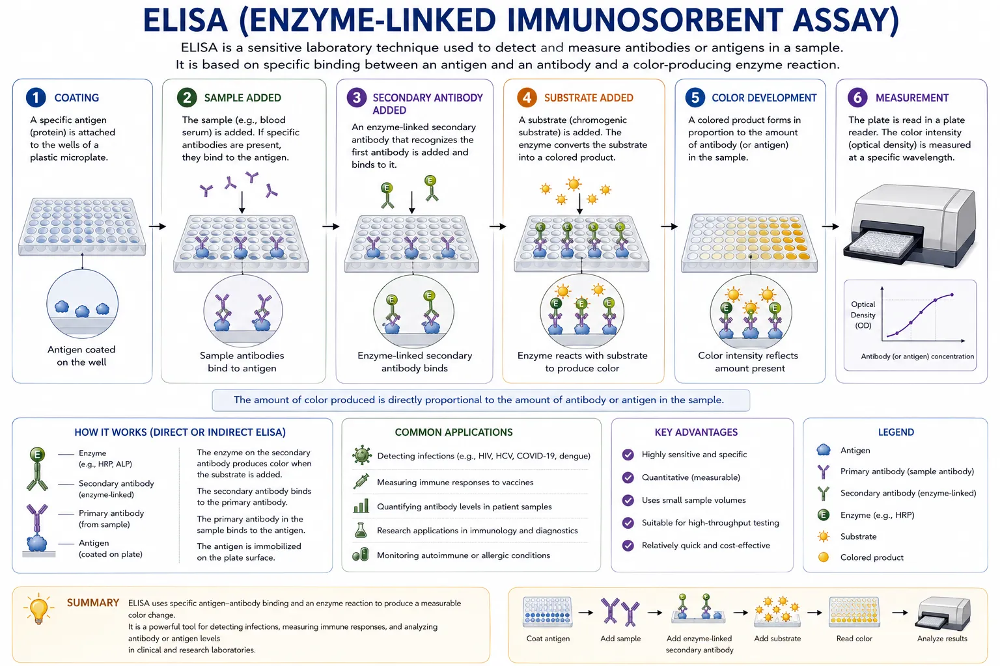
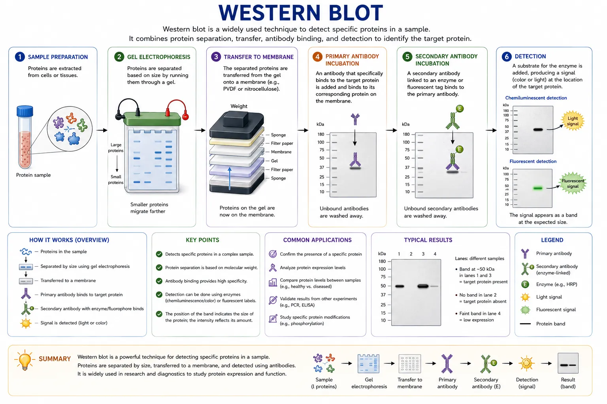
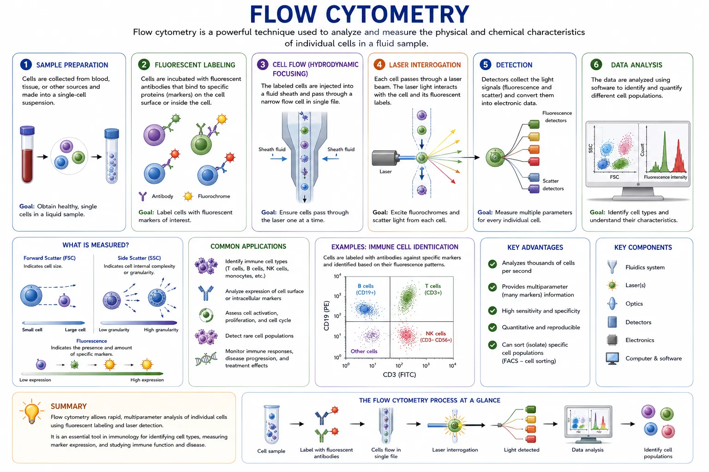
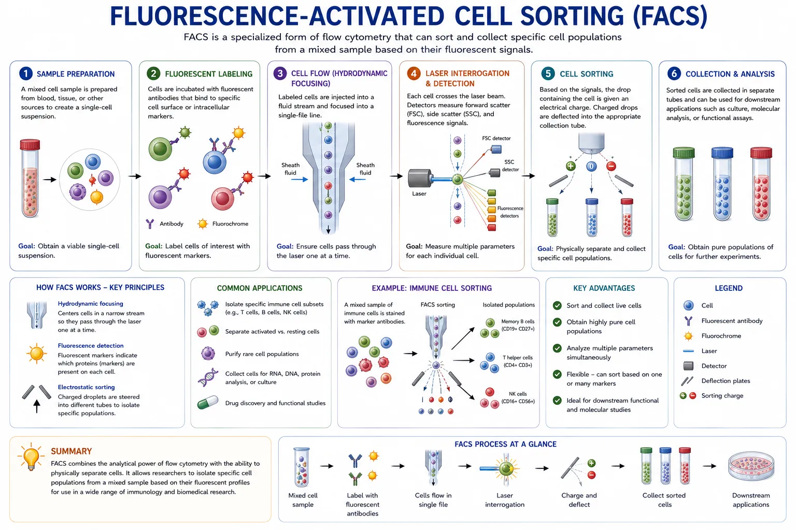
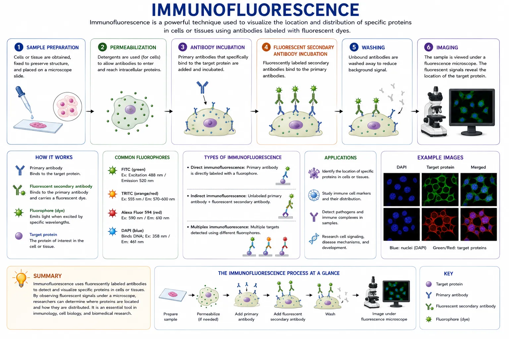
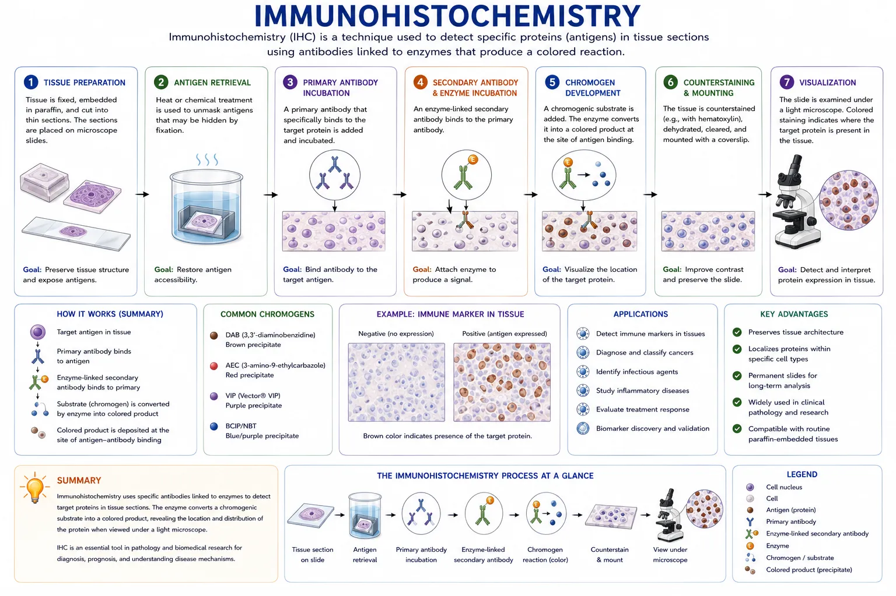
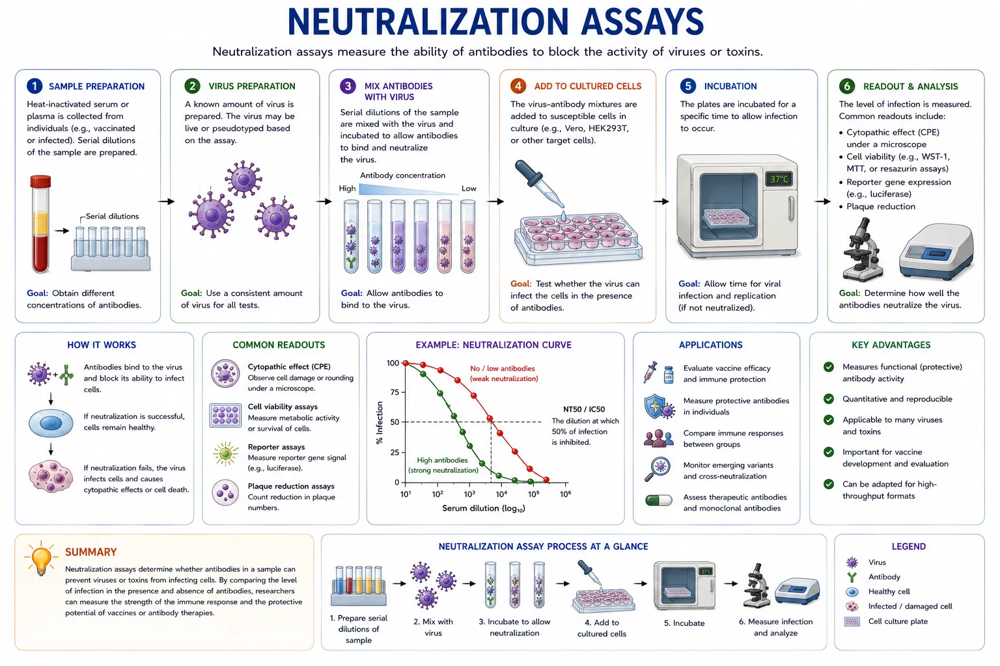
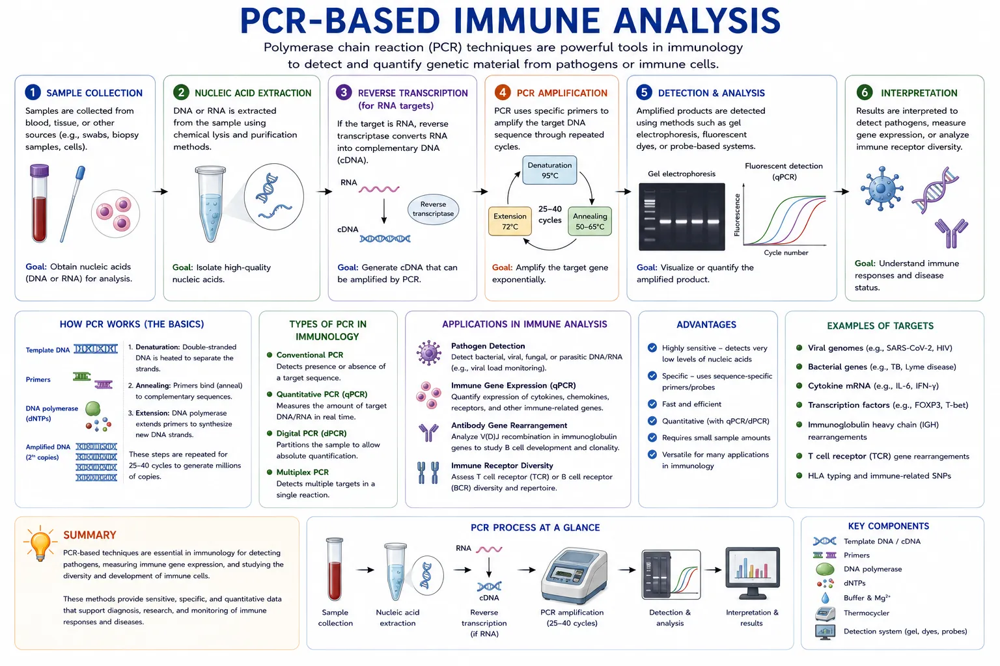
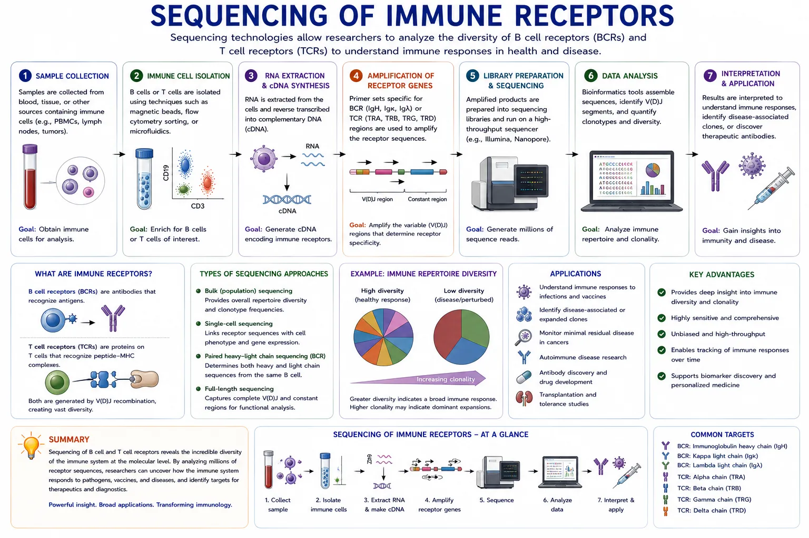

# Techniques Used in Immunology Research

Immunology research uses many laboratory techniques to study the immune system. These techniques help scientists detect antibodies, measure immune responses, identify immune cells, and understand how the immune system reacts to infections, vaccines, cancer, autoimmune diseases, and other health conditions.

Many immunology techniques are based on the specific binding between antibodies and antigens. An antigen is a molecule that can be recognized by the immune system. It may come from a virus, bacterium, parasite, toxin, vaccine, cancer cell, or even the body’s own tissues.

Antibodies are useful tools because they bind very specifically to their target. Scientists can attach antibodies to enzymes, fluorescent dyes, or other labels. This makes it possible to “see” or measure molecules that would otherwise be too small to detect easily.

Different techniques answer different questions. For example, some techniques show whether a person has antibodies against a virus. Others show which immune cells are present in a blood sample. Some methods show where immune proteins are located in tissues, while others measure how well antibodies can block infection.

Below are some of the most commonly used techniques in immunology research.

## ELISA (Enzyme-Linked Immunosorbent Assay)

ELISA is one of the most widely used methods to detect antibodies or antigens in a sample. It is commonly used because it is sensitive, relatively simple, and can test many samples at the same time.

In this technique, a protein or antigen is attached to the bottom of a plastic plate. The plate usually has many small wells, so researchers can test many samples in one experiment. A sample, such as blood serum, plasma, saliva, or cell culture fluid, is added to the wells.

If antibodies in the sample recognize the antigen, they will bind to it. Any antibodies that do not bind are washed away. This washing step is important because it removes extra material that could give a false result.

Next, a secondary antibody is added. This secondary antibody is linked to an enzyme. It binds to the first antibody. When a special chemical called a substrate is added, the enzyme changes the substrate and produces a color change.

The stronger the color, the more target antibody or antigen is likely present in the sample. A machine called a plate reader measures the color intensity. This gives researchers a numerical result instead of only a visual result.

ELISA can be used in different ways. An indirect ELISA is often used to detect antibodies in a patient or animal sample. A sandwich ELISA is often used to detect antigens or proteins, such as cytokines. Cytokines are signaling molecules that immune cells use to communicate. A competitive ELISA can be used when the target molecule is small or when researchers want to compare how strongly different antibodies bind.

ELISA is commonly used to detect infections, measure immune responses after vaccination, study allergy responses, and measure antibody levels in research studies. It is also used to measure immune proteins such as interleukins, interferons, and tumor necrosis factor.

One major advantage of ELISA is that it can measure many samples quickly. However, the result depends on the quality of the antigen, antibodies, controls, and washing steps. Good controls are needed to show that the test is working correctly.

## Western Blot

Western blot is a technique used to detect specific proteins in a sample. It is often used to confirm that a certain protein is present and to check the size of that protein.

First, proteins are collected from a sample. The sample may come from cells, tissues, blood, or microorganisms. The proteins are mixed with chemicals that help unfold them and give them a negative charge. This helps the proteins move through a gel based mainly on their size.

The proteins are then separated using gel electrophoresis. Smaller proteins move faster through the gel, while larger proteins move more slowly. After separation, the proteins are transferred from the gel onto a thin membrane. This membrane is usually made of nitrocellulose or PVDF.

The membrane is treated with a blocking solution. This step covers empty spaces on the membrane so antibodies do not stick randomly. Then, a primary antibody is added. This antibody is chosen because it binds to the protein of interest.

After washing away extra antibody, a secondary antibody is added. The secondary antibody binds to the primary antibody and carries a label, such as an enzyme or fluorescent tag. This label allows the protein to be detected.

The final result usually appears as a band on the membrane. The position of the band shows the approximate size of the protein. The darkness or brightness of the band gives an idea of how much protein is present.

Western blot is useful because it gives information about both the presence and size of a protein. This can help researchers check whether an antibody is detecting the correct target. It can also show whether a protein is produced more or less under different conditions.

In immunology, Western blot can be used to study immune signaling proteins, viral proteins, antibody targets, and changes in protein expression after immune cells are activated.

A common control in Western blot is a loading control, such as actin or tubulin. This helps show that similar amounts of protein were loaded in each lane. Without controls, it can be hard to know whether differences between bands are meaningful.

Western blot is powerful, but it is usually slower than ELISA and does not test as many samples at once. It is often used when researchers need more detailed confirmation of a protein result.

## Flow Cytometry

Flow cytometry is a technique used to analyze individual cells in a fluid sample. It allows researchers to study thousands or even millions of cells very quickly.

In this method, cells are labeled with fluorescent antibodies. These antibodies bind to specific markers on the surface of cells or inside cells. Many immune cells have special marker proteins that help identify what type of cell they are.

For example, T cells often express CD3. Helper T cells usually express CD4. Cytotoxic T cells usually express CD8. B cells often express CD19 or CD20. Natural killer cells often express CD56. By using antibodies against these markers, researchers can identify different immune cell populations.

After labeling, the cells are passed through the flow cytometer in a narrow stream of fluid. The cells move one at a time through a laser beam. As each cell passes the laser, the machine records light signals.

Some signals show the size of the cell. Other signals show how complex or grainy the cell is inside. Fluorescent signals show which markers are present on the cell. Because several fluorescent antibodies can be used at the same time, researchers can measure many markers on each cell.

The results are often shown as graphs called plots. Researchers use these plots to select groups of cells. This process is called gating. For example, a researcher might first select white blood cells, then select lymphocytes, then separate T cells, B cells, and natural killer cells.

Flow cytometry is commonly used to count immune cell types, study immune activation, measure cytokine production, detect rare cell populations, and examine how immune cells respond to vaccines or infections.

Flow cytometry can also be used to study cells inside the cell, not just on the surface. For this, cells are usually fixed and treated so antibodies can enter the cells. This allows researchers to detect proteins such as cytokines or transcription factors.

One major advantage of flow cytometry is that it gives information about single cells. This is important because immune samples often contain many different cell types mixed together. Instead of measuring the average of the whole sample, flow cytometry can show what each cell type is doing.

However, flow cytometry requires careful planning. The antibodies must be chosen well, and the fluorescent colors must be selected so their signals can be separated. Good controls are needed to interpret the data correctly.

## Fluorescence-Activated Cell Sorting (FACS)

FACS is a specialized form of flow cytometry that can separate cells based on their properties. Flow cytometry mainly analyzes cells, while FACS can physically sort and collect selected cells.

The cells are first labeled with fluorescent antibodies, just like in regular flow cytometry. These antibodies bind to markers on the cells. The labeled cells are then passed through the instrument one at a time.

As each cell passes through the laser, the machine detects its fluorescent signals. The instrument then decides which group the cell belongs to. Tiny droplets containing individual cells are given an electrical charge. The charged droplets are guided into different collection tubes.

This allows researchers to separate one type of cell from a mixed sample. For example, scientists can isolate helper T cells, cytotoxic T cells, regulatory T cells, memory B cells, plasma cells, dendritic cells, or natural killer cells.

After sorting, the collected cells can be used for more experiments. Researchers may grow the cells in culture, test how they respond to stimulation, study their genes, measure their proteins, or use them in sequencing experiments.

FACS is especially useful when the cells of interest are rare. For example, a researcher may want to isolate antigen-specific B cells after vaccination. These cells may make up only a small part of the blood sample, so sorting helps collect them for further study.

FACS is also useful in antibody discovery. Scientists can label cells with a specific antigen and then sort B cells that bind to that antigen. These B cells may produce useful antibodies.

One important goal in FACS is purity. Purity means that the sorted sample contains mostly the desired cell type. Researchers also care about cell survival because sorted cells may need to remain alive for later experiments.

FACS is powerful, but it can be slower and more complex than regular flow cytometry. It also requires careful instrument setup, good sample preparation, and proper controls.

## Immunofluorescence

Immunofluorescence is a technique used to visualize proteins, cells, or tissue structures under a microscope. It helps researchers see where a specific molecule is located.

In this method, antibodies are attached to fluorescent dyes. These antibodies bind to specific proteins in cells or tissues. When the sample is viewed with a fluorescence microscope, the labeled proteins glow.

The glowing signal shows where the target protein is found. For example, a protein may be located on the cell surface, inside the cytoplasm, inside the nucleus, or in a specific part of a tissue.

There are two common forms of immunofluorescence. In direct immunofluorescence, the primary antibody already has a fluorescent dye attached to it. In indirect immunofluorescence, the primary antibody binds to the target, and then a fluorescent secondary antibody binds to the primary antibody. Indirect immunofluorescence is often stronger because more than one secondary antibody can bind to each primary antibody.

Samples are often fixed before staining. Fixing helps preserve the cells or tissues and keeps structures in place. Sometimes the sample is also treated to make small holes in the cell membrane. This allows antibodies to enter the cell and bind to internal proteins.

Immunofluorescence can use several colors at once. This allows researchers to see whether different proteins are found in the same place. For example, one color may label T cells, another color may label B cells, and another color may label a virus or cytokine.

In immunology, this technique is useful for studying immune cell movement, inflammation, infection sites, antibody binding, and the organization of immune tissues such as lymph nodes or spleen.

Immunofluorescence gives strong visual information. It can show patterns that other techniques cannot show. However, it is usually not the best method for measuring large numbers of samples. It also requires good microscopes and careful staining to avoid background signal.

## Immunohistochemistry

Immunohistochemistry, often called IHC, is a technique used to detect specific proteins in tissue sections. It is similar to immunofluorescence, but it usually uses an enzyme reaction that creates a colored stain instead of a fluorescent signal.

In this technique, a thin slice of tissue is placed on a microscope slide. The tissue may come from a biopsy, an animal study, or a stored tissue sample. The sample is treated so antibodies can bind to the target protein.

A primary antibody binds to the protein of interest. Then a secondary antibody is added. This secondary antibody is linked to an enzyme. When a chemical substrate is added, the enzyme causes a color change. The colored area shows where the target protein is located.

The tissue is often counterstained with another dye. This helps show the overall structure of the tissue, such as the location of cells and nuclei. Researchers can then see both the immune marker and the tissue structure at the same time.

IHC is widely used because it shows where immune cells or proteins are located inside real tissue. This is important because location matters. For example, immune cells inside a tumor may have a different meaning than immune cells outside the tumor. In infected tissue, IHC can show where immune cells are gathering and which areas are damaged.

In immunology and pathology, IHC is used to study cancer, infections, autoimmune diseases, inflammation, transplant rejection, and immune cell infiltration. It can identify markers such as CD3 for T cells, CD20 for B cells, CD68 for macrophages, and many others.

One advantage of IHC is that the stained slides can often be viewed with a regular light microscope. The slides can also be stored for later review. This makes IHC very useful in medical research and diagnostic pathology.

However, IHC results depend strongly on antibody quality, tissue preparation, and staining conditions. A weak stain may mean low protein levels, but it may also mean the staining did not work well. This is why positive and negative controls are important.

## Neutralization Assays

Neutralization assays measure the ability of antibodies to block the activity of viruses, toxins, or other harmful agents. In immunology, they are often used to test whether antibodies can protect cells from infection.

In a virus neutralization assay, antibodies from a sample are mixed with a virus. The sample may come from a vaccinated person, an infected person, an animal study, or an antibody-producing cell culture. The virus and antibodies are allowed to interact.

The mixture is then added to cultured cells that the virus can normally infect. If the antibodies are effective, they bind to the virus and stop it from entering the cells. If the antibodies are weak or absent, the virus infects the cells.

Researchers then measure how much infection occurred. This can be done in different ways. They may look for cell damage, count plaques, measure viral proteins, or use a reporter signal such as light production. The more the antibodies block infection, the stronger the neutralizing activity.

The result is often reported as a neutralization titer. This tells researchers how much the sample can be diluted while still blocking infection. A higher titer usually means stronger neutralizing antibody activity.

Neutralization assays are especially important in vaccine research. A vaccine may cause the body to make antibodies, but researchers also want to know whether those antibodies can actually block infection. ELISA can show that antibodies bind to a virus, but a neutralization assay can show whether those antibodies can stop the virus from infecting cells.

Some neutralization assays use live viruses. These require special safety conditions. Other assays use pseudoviruses, which are safer virus-like particles that carry only part of the virus. Pseudovirus assays are often used when researchers want to study virus entry without using the full infectious virus.

Neutralization assays are also used to compare antibody responses against different virus variants. This helps researchers understand whether antibodies still work when a virus changes.

These assays are powerful, but they can take more time than binding tests like ELISA. They also require living cells, careful controls, and sometimes special biosafety equipment.

## PCR-Based Immune Analysis

Polymerase chain reaction, or PCR, is a technique used to detect and copy small amounts of genetic material. In immunology, PCR is useful for studying infections, immune cell activity, and immune gene expression.

PCR can amplify DNA, which means it makes many copies of a specific DNA sequence. This allows researchers to detect genetic material even when only a tiny amount is present.

When the starting material is RNA, researchers first convert RNA into DNA using a step called reverse transcription. This method is called RT-PCR. It is commonly used to detect RNA viruses or to study gene expression.

A common form of PCR is quantitative PCR, or qPCR. qPCR measures how much genetic material is present while the reaction is happening. This allows researchers to estimate the amount of virus, bacteria, or gene expression in a sample.

For example, qPCR can be used to measure how strongly immune cells are producing cytokine genes after stimulation. If a T cell is activated, it may increase expression of genes for interferon-gamma or interleukin-2. PCR can help measure these changes.

PCR is also used to detect pathogens. If a sample contains genetic material from a virus or bacterium, PCR can amplify a specific part of that genetic material. This makes PCR useful for studying infections even when the pathogen is present at low levels.

In immunology, PCR can also be used to study antibody genes and T cell receptor genes. B cells and T cells rearrange their receptor genes as they develop. PCR can help researchers study these rearrangements and understand immune receptor diversity.

PCR-based methods are very sensitive. This is a major advantage, but it also means contamination can be a problem. Even a tiny amount of unwanted DNA can affect the result. For this reason, PCR experiments need careful sample handling and proper controls.

PCR tells researchers about genetic material, not always about protein levels or cell behavior. For this reason, PCR is often used together with other techniques such as ELISA, flow cytometry, Western blot, or sequencing.

## Sequencing of Immune Receptors

Modern sequencing technologies allow scientists to study immune receptors in great detail. These methods are used to examine the huge variety of B cell receptors and T cell receptors in the immune system.

B cells make antibodies. Each B cell has a unique B cell receptor, which is related to the antibody it can produce. T cells have T cell receptors that allow them to recognize infected cells, cancer cells, or other immune targets.

The body can make millions of different immune receptors. This diversity helps the immune system recognize many possible threats. Sequencing allows researchers to read the genetic instructions for these receptors.

B cell receptor sequencing and T cell receptor sequencing are often used to study the immune repertoire. The immune repertoire means the full collection of different receptors found in a person, animal, or tissue sample.

These methods can show which immune cell groups are expanding during an immune response. For example, after infection or vaccination, certain B cells or T cells may multiply because they recognize the antigen. Sequencing can help identify these expanded groups, sometimes called clones or clonotypes.

B cell receptor sequencing can also show how antibodies change over time. B cells can improve their antibodies through a process called somatic hypermutation. This process introduces small changes into antibody genes. Sequencing can help researchers study how antibodies become better at binding their target.

T cell receptor sequencing can help researchers study immune responses in infections, cancer, autoimmune disease, and transplant rejection. It can show whether certain T cell clones are common in a disease or whether they increase after treatment.

Some sequencing methods study many cells together. Other methods, called single-cell sequencing, study one cell at a time. Single-cell methods can connect receptor sequences with other information, such as which genes a cell is expressing. This helps researchers understand not only what receptor a cell has, but also what that cell may be doing.

Immune receptor sequencing is widely used in vaccine research, antibody discovery, cancer immunotherapy, autoimmune disease studies, and immune repertoire analysis.

One important advantage of sequencing is that it gives very detailed information about immune diversity. However, the data can be complex. Researchers need computer analysis to organize the sequences, identify patterns, and compare samples.

Sequencing does not always prove that a receptor protects against disease. It shows which receptors are present and how they change. Other experiments are often needed to test what those receptors actually do.

